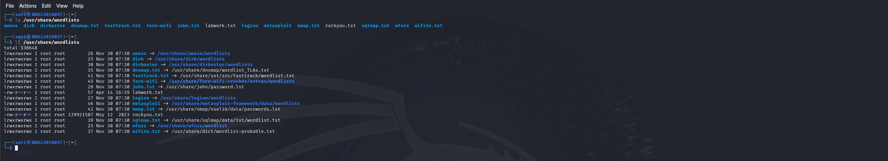
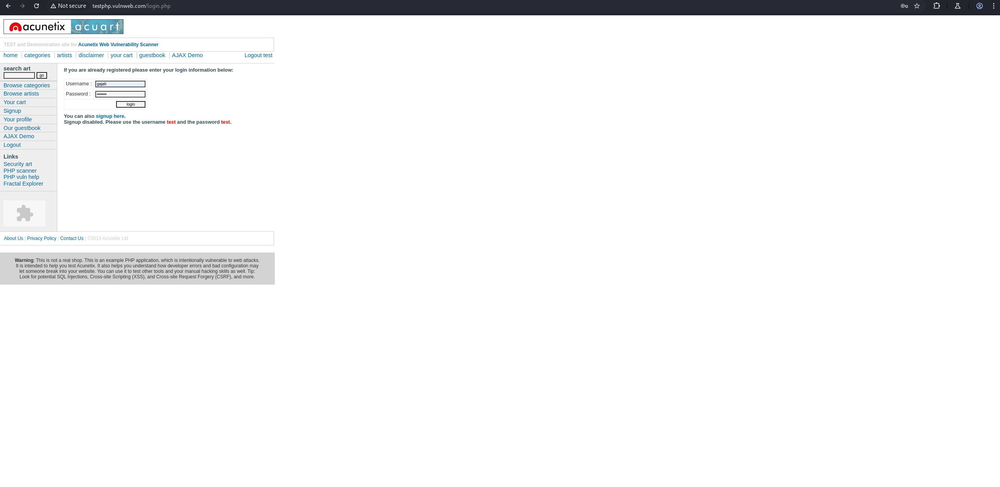
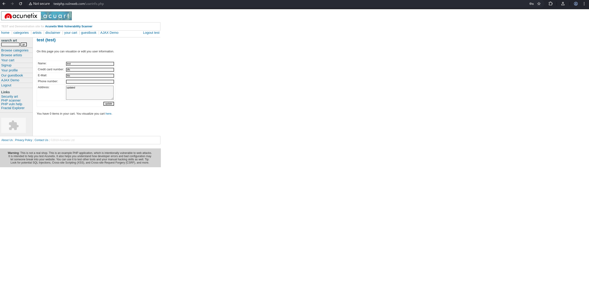
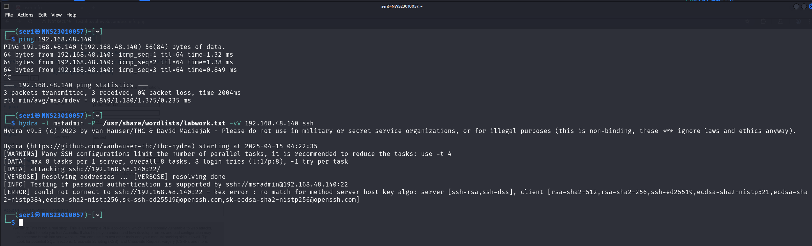

# 👋🏻**Hello and Welcome!**
This is my first lab task for this subject and I will be taking you on a quick walkthrough of what I did. It's pretty straightforward so feel free to follow along. Let's dig in!

For those who interested to follow along, ensure all of these OS and tools are installed first ya and happy learning!

### 💻 Operating Systems
 

| OS | Role  |                                    
|------------|-----|
| Kali Linux    | Attacker
| Metasploitable2  | Victim  

### 🛠️ Tools

| Tool | Role  |                                    
|------------|-----|
|enum4linux| enumeration|
|NetExec    | Brute force FTP
|Hydra  | Brute force TELNET  |
|Medusa | Brute force SSH |
|Burpsuite | Brute force HTTP|
|Wiresharp |Sniff network|

> 🚨 You can just install at least one tool between NetExec, Hydra, and Medusa to brute force FTP, TELNET and SSH but some of the services may not supported the tool you choose. Plus, it good to know many bruteforce tools

### 🎯Objective
The goal of this lab is to explore the vulnerabilities of common network protocols (FTP, TELNET, SSH, HTTP) by performing brute force attacks to recover passwords and then using credentials received to sniff network traffic. Then, we will analyze the security of these protocols and propose mitigation strategies

## 🧪 Lab Tasks

### 1️⃣Enumeration
We will identify the portential usernames for brute force attacks using enum4linux tool.

> If you are new to this tool just simply type the tool name and click enter. It will provide the manual as a guidance for you.

    enum4linux -U 192.168.48.140

and BOOM💥 you got the user list of targeted machine.

### 2️⃣ Brute Force Attacks
Next we will brute force some services using different type of brute force tool. Before proceed we need to have a wordlists of usernames and passwords. Kali Linux has many of it just pick which one you like.

✏️If you want to be creative and create your own version, you can!
        
    sudo vim /usr/share/wordlists <wordlists name>

## 🔐FTP Brute Force (NetExec)
    netxec ftp <target-IP> -u /usr/share/wordlists/labwork.txt -p /usr/share/wordlists/labwork.txt
- -u: 	Path to a file containing a list of usernames 
- -p:   Path to a file containing a list of passwords

Look for the correct login credential. You can identified by simply look at the symbol. Spot for [➕] sign. That indicate the login successful. To confirm it, let's try login.

        ftp <target IP>

## 🔐TELNET Brute Force (Hydra)
        hydra -l msfadmin -P /usr/share/wordlists/labwork.txt -vV <target_IP> telnet

- -l: login name
- -P: Path to a file containing a list of passwords
- -v: verbose mode
- -V: show login+pass for each attempt

Just like FTP, we will try to loginb the service to confirm to credential is valid. Similar to run FTP, just change FTP service to TELNET service.

        telnet <target IP>

## 🔐SSH Brute Force (Medusa)
        medusa -h <target IP> -U /usr/share/wordlists/labworb.txt -P /usr/share/wordlists/labworb.txt -M ssh -V15

**👀LOOK!** **There is a success attemp. What are you waiting for? Let's try it!🔥**

        ssh -OHostKeyAlgorithms=+ssh-rsa username@<target IP>

## 🔐HTTP Brute Force
First of all, look for vulnerable HTTP website that require login. We will use them to try the result of out brute force attacks. There are lot in the internet. For my tutorial, I will use acunetix vulnweb.

> ⚠️ HTTP and HTTPS are different. Make sure targeted website URL is HTTP

1. Open burp suite and turn on the intercept function. This wil block the traffic until aattacker let them. So in the meantime attacker can inspect or even modify HTTP request.
2. Open targeted website and login. You can put anything.
3. Right click to send request to intruder.
4. Switch to intruder tab and highlight ther username and password inserted. Add them as payload and load your wordlists.
5. Once the process complete, focus at the staus code and length column. Look for 200 status code and check for it length. Usually successful login have 200 staus code with the highest value of length 
6. Use the credential to login.

### 3️⃣🔍 Sniff the network
Now, we will test the vulnerability of tested services just now. We will use all retrieved credential to log in and see how they respond in wireshark.

1. Turn on wireshark
2. Log in all the services using retrieved credential

🔎The screenshot below, show the output of wireshark

### FTP

### TELNET

### SSH

### HTTP

From the output, we can see that:
| Services| Output  |                                    
|------------|-----|
|FTP| The username and password is in plaintext|
|TELNET    | The traffic is unencrypted|
|SSH | the tarffic is encrypted |
|HTTP | The username and password is in plaintext |

###  4️⃣ 😵‍💫Analyze Problems Encounter
Alhamdulillah, we have come to the end of this walkthrough. Let's throwback some problem that I encounter during the process of this labwork. Let's go🔥

- The problem encounter here is, I initially use hydra to brute force SSH but it looks like hydra do not support the older server key types (ssh-rsa, ssh-dsa) by default.

### **💡SOLUTION**
Like I mention previously before we start, some brute force might not work on some service. Theredore, I switch to medusa to brute force ssh. Based on my research, hydra and medusa use different underlying libraries. Medusa on the other hand use its own implementation of the SSH client  or is compiled with more relaxed or compatible default. Resulting in able to connect to legacy systems🧓🏻 like metasploitable2

### 5️⃣ 🛡️ Proposed Mitigation strategies

 | Services| Mitigation | Justification|                                    
|------------|-----|-------------------|
|FTP| Replace with SFTP | SSH File Transfer Protocol (SFTP) ensure data is encrypted
|TELNET    |Use SSH| SSH provide secure, encrypted communication
|SSH |Use key-based authentication| Key-based authentication is more secure than password
|HTTP |Use HTTPS| HTTPS encrypts traffic to prevent interception and tampering

✨And that’s it! Thank you for reading and I hope this walkthrough helps you understand the basics of network protocol security and brute force attacks. Keep learning and have fun 💻🔐🎉